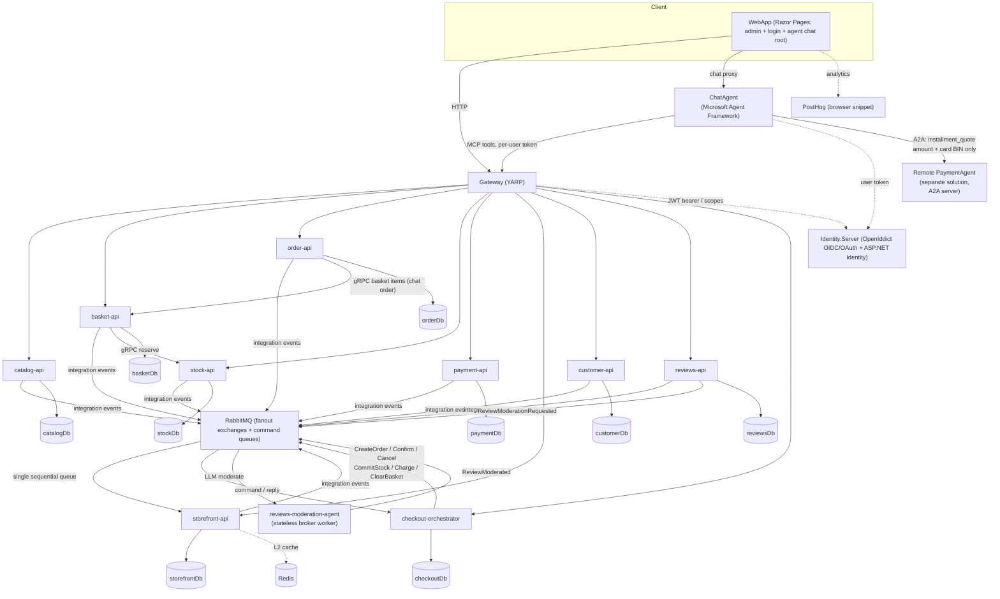

# ECommerce with Agent Framework

> An event-driven, Domain-Driven microservices e-commerce platform with a built-in AI shopping agent — orchestrated end-to-end with .NET Aspire.

<p>
  
  
  
  
  
  
  
  
  
  
  
</p>

## Overview

This is a full **microservices e-commerce backend** where every service is an isolated **bounded context** with its own database, and cross-context communication happens only through **integration events**, the **Model Context Protocol (MCP)**, and — where a step needs an immediate yes/no or a hand-off between contexts — sanctioned **typed gRPC** (stock reservation) and **broker command/reply** (the checkout saga). Around the core sit two AI agent applications, both on the **Microsoft Agent Framework**:

- **ChatAgent** — an AI shopping assistant that acts as an **MCP client**: it browses the catalog, manages a basket, and reviews a user's orders and payments by calling each service's MCP tools with that user's token. Via the **Agent2Agent (A2A)** protocol it delegates installment quotes to a **remote payment agent living in a separate solution**, passing only the cart total and the default card's non-sensitive **BIN** — never the PAN, CVV, or token.
- **Reviews Moderation Agent** — a **stateless broker worker** that moderates product reviews with an LLM (structured JSON, temperature 0, no MCP). It consumes a `ReviewModerationRequested` event, classifies the text, and replies with `ReviewModerated` — the Reviews context itself holds zero agent-framework code, keeping the moderation model behind an event boundary.

The catalog is **first-party**: the store owns its inventory, so product entry is plain product CRUD (an earlier multi-supplier ingestion pipeline was intentionally dismantled). New products flow `Catalog → Stock` (initial on-hand) and `Catalog → Storefront` (read-model) over integration events.

It's a portfolio / learning project built to demonstrate how far you can push **DDD, CQRS, and event-driven design** in real .NET code — and how a modern LLM agent plugs into that architecture cleanly, without leaking business logic into the agent layer.

## What this project demonstrates

- **Bounded-context isolation** — ten database-owning bounded contexts, each with its own PostgreSQL database and Marten schema, plus a gateway, two agent workers, and a web UI. No shared domain model; the same concept (e.g. *Product*) is modeled differently in each context — a rich aggregate in Catalog, a plain basket-item entity in Basket, a read-model row in Storefront.
- **Rich aggregates & enforced invariants** — business rules live inside aggregates (private collections, behavior methods), not in handlers. Illegal states are unrepresentable.
- **Vertical Slice + CQRS** — code is organized by feature, not by technical layer. Writes and reads are separate slices; no repositories — handlers use Marten's `IDocumentSession` directly.
- **Result pattern over exceptions** — expected failures (not-found, validation, rule violations) flow through typed `Result` objects; exceptions are reserved for the truly unexpected.
- **Scope-based authorization** — identity issued by OpenIddict + ASP.NET Identity; services authorize on OAuth **scopes** (no roles), enforced on HTTP endpoints *and* on Wolverine message handlers.
- **Agent-only storefront** — the customer-facing web screens (home/storefront, product list & detail, category/author/publisher indexes, basket, checkout, account) were **intentionally removed (066)**: the store root (`/`) *is* the shopping assistant, and every customer action (search, basket, order, address, review, price alarm) runs through the ChatAgent's MCP tools. The WebApp keeps only **admin** (product editing + merchant onboarding), **login/OIDC**, the **chat** surface, and its BFF proxy — anonymous storefront browsing and SEO are deliberately traded away for an agent-first posture. The storefront read model and hybrid search below still exist; they are now surfaced **through the agent**, not a web page.
- **Push-only read model** — the `storefront` service maintains a product-centric composite view (catalog + stock + review summary) fed purely by integration events on a **single sequential queue** — no outbound calls, no backfill. A fat `ProductChangedEvent` carries name, description, authors + publisher, category ids+names, price, so one read renders a full card with stock badges. The view filters by dynamic **category & author** (AND-combinable; facet options derive from the same view, so empty categories never appear) — consumed by the agent's `search_storefront_products` tool (plus an anonymous REST twin).
- **Variant families** — the storefront groups existing products sharing a `familyCode` into one card plus a derived-axis selector (no combinatorial generation) — the feed field flows through the same push-only view.
- **Hybrid product search (filters + semantic, via chat)** — the storefront exposes a single `search_storefront_products` MCP tool (plus an anonymous REST twin): optional author-OR / price-range / min-stock filters combined with a natural-language `searchText`. Embeddings (`text-embedding-3-small`) are produced on `ProductChangedEvent` only when the search text's hash actually changed, stored as a side document in **pgvector**-enabled `storefrontDb`, and queried with a raw cosine-distance SQL join — filters stay hard, ranking is semantic, and an embedding outage never blocks the view write or filter-only search. No `searchText` → Marten LINQ over sellable rows with a pure, unit-testable filter core (deterministic `Name ASC`); with `searchText` → hand-written SQL, because top-K + similarity-threshold must run *in the database*. The query vector travels as a **text parameter** with a server-side `::vector(1536)` cast (immune to Npgsql's pg_type cache race), every user value is a bound parameter, and an `INNER JOIN` on the embedding side-table makes "no embedding → not ranked" structural rather than conditional.
- **Verified-purchase reviews with model-behind-a-boundary moderation** — the `reviews` context accepts a 1–5★ review only from a buyer who actually purchased the product; eligibility is projected locally from an `OrderCompleted` integration event (a `PurchasedProduct` read model), not a synchronous call. AI moderation runs **out-of-band** in a separate broker worker (`ReviewModerationRequested → LLM → ReviewModerated`); a rating summary event flows on to Storefront.
- **Saved cards & addresses with PCI-safe tokenization** — a `customer` bounded context holds each user's **Wallet** (saved cards) and **AddressBook**, two aggregates keyed by user id with a "≤1 default" invariant. Raw PAN/CVV are **never persisted, logged, evented, or exposed** — `AddCard` passes them to a tokenizer and stores only a token + brand + last4 + BIN + expiry. MCP exposes **read-only** tools (`list_cards` / `list_addresses`) — there is deliberately no add-card tool. In chat checkout the user **selects** a saved address and card, defaulting to the marked-default of each (card add/remove stays out of the store — a PSP/ACP concern).
- **Cross-agent delegation over A2A (installment quotes)** — ChatAgent is also an **Agent2Agent client**: for installment options it resolves the cart total (`get_basket`) and the default card's **BIN** (`get_default_card_bin`), then delegates to a **remote payment agent** in a *separate* solution. It discovers the agent from its `/.well-known/agent-card.json`, verifies the advertised `installment_quote` skill, and wraps it as a callable tool (`AsAIFunction`). The boundary is **PCI-clean** (only amount + non-sensitive BIN cross the wire) and **fail-open** (unconfigured/unreachable → the tool just isn't added, everything else keeps working).
- **Durable checkout orchestration (broker-only saga)** — checkout is a **standalone `Checkout.Orchestrator` service** running a Wolverine durable saga (state in Marten, keyed by `CheckoutId`); every step is an async RabbitMQ **command/reply**, so each context stays isolated behind its own queue. The sequence is `CreateOrder → CommitStock (per item) → Charge → Confirm → ClearBasket`. A **pivot rule** splits the timeline at **Charge** (single-phase capture, the last reversible line): everything *before* is compensatable (LIFO stock revert + order cancel — no money has moved), everything *after* is forward-only. A scheduled `CheckoutTimedOut` **watchdog** compensates a run that stalls before the pivot. The same durable-scheduling primitive retires cron: basket-reservation expiry is a Wolverine **`ScheduleAsync`** message that fires `ReservationExpired`, not a polling sweep.
- **AI agent as a first-class client** — each service exposes its Wolverine commands/queries as MCP tools; ChatAgent consumes them per-user. MCP tools are thin wrappers — zero business-logic duplication.
- **Declarative, cross-cutting caching** — read queries are cached with a single `[Cached(...)]` attribute via an `IMessageBus` decorator over HybridCache (L1 in-memory + optional Redis L2). Handlers stay untouched.
- **Product analytics** — the web UI ships a key-gated **PostHog** browser snippet (pageviews, autocapture, session replay) — a write-only client key from user-secrets; absent key → snippet simply isn't emitted.
- **One-command orchestration** — .NET Aspire spins up every service, gateway, Postgres, RabbitMQ, and Redis with service discovery and connection-string injection.
- **Spec-driven development** — non-trivial features go through a GitHub spec-kit flow (spec → plan → tasks → implement) governed by a project constitution.

## Architecture



Each service is a self-contained bounded context. Synchronous read/write traffic goes **client → YARP gateway → service**, secured by JWT bearer tokens with OAuth scopes issued by Identity.Server. State changes are published as **integration events** over RabbitMQ fanout exchanges; the `storefront` read model is built entirely by consuming those events on a **single sequential queue** (structurally eliminating concurrent writes to the same composite row). The **ChatAgent** reaches the services' MCP endpoints through the gateway, injecting the calling user's token at invocation time so the agent acts *as that user*.

Two cross-context channels are sanctioned beyond events. **Stock reservation** runs over a typed **gRPC** contract (`Shared/Protos`): Basket calls Stock synchronously at add-to-cart (fail-closed — no reservation, no add), on-hand stock is authoritative in Stock itself, and a reservation is only turned into a decrement when the checkout saga commits it. **Checkout** runs as a **broker command/reply saga** hosted in its own `Checkout.Orchestrator` service: the web endpoint (or the chat order path) publishes `StartCheckout`, and the orchestrator drives Order, Stock, Payment, and Basket through their command queues (stock commit, charge, confirm, basket clear), each replying to a single correlation-keyed reply queue.

## Tech Stack

| Area | Technology |
|------|-----------|
| Runtime | .NET 10, C# (nullable + implicit usings) |
| Orchestration | .NET Aspire (AppHost + ServiceDefaults) |
| Persistence | Marten (PostgreSQL as document / event store) |
| In-process bus & messaging | Wolverine (CQRS bus + RabbitMQ integration messaging + durable sagas) |
| Messaging transport | RabbitMQ (fanout exchanges + command/reply queues) |
| Caching | HybridCache (L1 in-memory + optional Redis L2), AOP decorator |
| Identity & AuthZ | OpenIddict + ASP.NET Identity (OIDC/OAuth, scope-based) |
| API Gateway | YARP (with Aspire service discovery) |
| Sync RPC | gRPC (stock reservation, basket items/clear — shared proto contracts) |
| AI Agents | Microsoft Agent Framework + Microsoft.Extensions.AI (OpenAI), MCP |
| Cross-agent protocol | Agent2Agent (A2A) — `Microsoft.Agents.AI.A2A` client to a remote payment agent |
| UI & analytics | ASP.NET Core Razor Pages + PostHog browser analytics |
| DI | Scrutor (convention-based auto-registration) |
| Testing | xUnit + Shouldly (pure domain unit tests) |

## Services

| Project | Responsibility |
|---------|----------------|
| `catalog-api` | Rich `Product` + `Category` + `Author` + `Publisher` + tags + specification attributes (book metadata: multi-author, single publisher). First-party product write path |
| `basket-api` | User baskets and items; synchronous gRPC stock reservation (fail-closed) |
| `order-api` | Order aggregate + lifecycle; broker-driven `Create/Confirm/Cancel` from the checkout orchestrator; chat order path (charge → `StartCheckout`); `OrderCompleted` on confirm |
| `stock-api` | `ProductStock` (on-hand); initial stock from `ProductLinked`; gRPC reservation server |
| `payment-api` | Payment (mock, single-phase charge; amount only — no card fields) |
| `storefront-api` | Push-only composite read model (catalog + stock + review summary); facets, variant families, hybrid filter+semantic search |
| `customer-api` | Wallet (tokenized cards — no PAN/CVV; stores non-sensitive BIN) + AddressBook + `MerchantInformation` (gateway key) |
| `reviews-api` | Verified-purchase reviews (1–5★); purchase proof via `OrderCompleted` event; AI moderation delegated to a separate worker; rating summary event to Storefront |
| `checkout-orchestrator` | Standalone broker-only checkout saga (`checkoutDb`): `CreateOrder → CommitStock → Charge → Confirm → ClearBasket`, pivot = Charge, LIFO compensation + watchdog |
| `gateway` | YARP reverse proxy / single entry point |
| `identity-server` | OpenIddict + ASP.NET Identity — OIDC/OAuth authority + RBAC (roles map to scopes) |
| `chat-agent` | AI shopping assistant — MCP client over the gateway + A2A client to the remote payment agent |
| `reviews-moderation-agent` | Stateless broker worker — `ReviewModerationRequested → LLM (structured JSON) → ReviewModerated`; no database, no MCP |
| `ecommerce-web` | Agent-only Razor Pages UI — root (`/`) is the shopping assistant chat; keeps admin (product editing + onboarding) + login/OIDC + chat proxy BFF + PostHog. Customer browsing/basket/checkout/account screens removed (066) |

Shared foundations live under `src/others`: `Common` (domain building blocks, results, caching), `Shared` (integration-event contracts + gRPC protos), and `Identity.Server`.

## Key Design Decisions

- **A microservice = a bounded context.** The boundary is physical and hard: separate database, separate schema, separate domain model. Services never share a database or leak one context's model into another.
- **Aggregates own their invariants.** New rules go on the aggregate method, never in a handler. Collections are private and exposed read-only; mutation only flows through behavior methods.
- **Result over exceptions.** All handlers, aggregate methods, and endpoints return a `Result`; endpoints translate `IsSuccess` into `Ok`/`BadRequest`.
- **Caching is a decorator, not middleware.** Wolverine's `Before/After` hooks can't return a value on short-circuit, so caching is a transparent `IMessageBus` decorator (Scrutor `Decorate`) — endpoints and handlers stay unaware.
- **The agent adds no business logic.** MCP tools re-invoke the same Wolverine command/query via `IMessageBus`; they only add an LLM-friendly name and description.
- **A2A is a consumed contract, not a merge.** The remote payment agent lives in its own solution with its own database; this system *consumes* it over A2A the way it consumes integration events, MCP, and gRPC — a deliberate contract, never a shared model or DB.
- **The saga is a service, not a god-object.** Checkout orchestration owns a process across four contexts, so it lives in its **own** BC (`Checkout.Orchestrator`) and talks only over broker command/reply — never another service's database. A saga's process owner is a bounded context, not a shared orchestration layer.
- **Pivot over two-phase payment.** Payment is a single-phase `Charge` placed as the saga's last reversible step, so everything before it is compensatable (stock revert + order cancel) and nothing after needs a void/refund — the pivot line replaces authorize/capture/void machinery entirely.
- **Sync RPC only where a yes/no must be immediate.** Stock reservation (basket/order → stock) is the sanctioned synchronous channel: a typed gRPC contract, scope-protected, fail-closed. DB isolation still holds — callers hit Stock's API, never its database.
- **Idempotency over transactions across services.** Cross-context writes can't share a transaction. The checkout saga converges instead: deterministic `CheckoutId`/`PaymentId` keys, per-step idempotency keys, at-least-once delivery, and business failures routed to compensation rather than retried forever.
- **Eventual-consistency flows use events, not gRPC.** A review written *after* purchase doesn't need an instant answer, so purchase proof is an `OrderCompleted` projection — gRPC is reserved strictly for instant-consistency (stock).
- **The moderation model sits behind an event boundary.** Reviews holds no agent-framework code; moderation is a separate broker worker, so the LLM dependency never leaks into the review-writing context.
- **No roles leak downstream — scopes only.** Identity issues roles (a role is a bundle of scopes); services authorize purely on scopes. Reads (stock, storefront) are anonymous; tokens matter on the shopping write path.
- **Agent-first, screens second.** Once every customer operation had MCP parity, the customer-facing screens were removed and the store root became the shopping assistant (066). The web layer keeps only what an agent can't be: admin editing, the login/OIDC dance, and the chat-to-agent proxy. The WebApp requests only identity + management scopes — customer shopping scopes are gone, since the browser no longer performs those calls.

## Getting Started

### Prerequisites

- [.NET 10 SDK](https://dotnet.microsoft.com/)
- Docker (Aspire provisions PostgreSQL, RabbitMQ, and Redis as containers)

### Run the whole system

Always start the distributed system through the **Aspire AppHost** — services discover each other, their databases, and RabbitMQ via Aspire service discovery. Running a single API standalone will fail to resolve its dependencies.

```bash
# From the repo root
dotnet run --project src/aspire/AppHost/AppHost.csproj
```

This brings up every service, the YARP gateway, Identity.Server, the Razor Pages UI, both agents, plus PostgreSQL, RabbitMQ (with the management plugin), and Redis. The **Aspire dashboard** opens with a live view of every resource, its logs, and its endpoints.

> Identity.Server must run over **HTTPS** (its `SameSite=None; Secure` cookies loop forever on plain HTTP).

The OpenAI-backed services (**ChatAgent** and the **Reviews Moderation Agent**) fail fast at startup without credentials in user-secrets:

```bash
dotnet user-secrets set "OpenAI:ApiKey" "<key>"   --project src/agents/ChatAgent/ChatAgent.csproj
dotnet user-secrets set "OpenAI:ApiKey" "<key>"   --project src/agents/Reviews.Moderation/Reviews.Moderation.csproj
dotnet user-secrets set "OpenAI:Model"  "gpt-4o-mini" --project src/agents/Reviews.Moderation/Reviews.Moderation.csproj
```

Optional — enable PostHog product analytics in the web UI (absent key → snippet not emitted):

```bash
dotnet user-secrets set "PostHog:ApiKey" "<phc_...>" --project src/ui/WebApp/WebApp.csproj
```

### Build & test

```bash
# Build the whole solution
dotnet build

# Run all tests
dotnet test

# Run a single test project
dotnet test tests/Catalog.Api.Tests/Catalog.Api.Tests.csproj
```

## Project Structure

```
src/
  aspire/        AppHost (orchestration) + ServiceDefaults
  services/      basket, catalog, checkout, customer, gateway, order,
                 payment, reviews, stock, storefront
  others/        Common, Shared (contracts + protos), Identity.Server
  agents/        ChatAgent (MCP client, LLM) + Reviews.Moderation (broker worker, LLM)
  ui/            WebApp (Razor Pages)
tests/           Per-service domain unit tests (xUnit + Shouldly)
.specify/        Spec-driven development setup (spec-kit)
specs/           Feature specs / plans / tasks
```

A single service follows a **Vertical Slice** layout — code grouped by domain feature, not technical layer:

```
Domains/<Aggregate>/
  <Aggregate>.cs                  # rich aggregate root (factory + behavior methods)
  <Aggregate>EndpointExtension.cs # Minimal API endpoint mapping
  <Aggregate>McpTools.cs          # MCP tool wrappers for this aggregate
  Features/
    Commands/                     # write slices  (IDocumentSession, [Transactional])
    Queries/                      # read slices   (read-only)
    Agents/                       # agent-facing slices (exposed via MCP)
```

Each bounded context also carries a `FLOW.md` — a domain-process document (EventStorming altitude) describing the business steps, invariants, and boundary of that context, guarded by `scripts/check-flow-links.sh`.

## DropShop payment-gateway integration (032/033)

This storefront registers itself as a merchant with the external **DropShop** payment gateway
(a separate solution, consumed as a contract — never a shared DB/model) and then uses the
gateway's **card vault** for PCI-safe card storage:

- **Admin onboarding via chat (032)** — an admin-only Razor page (`Pages/Admin/Onboarding`) talks
  to the ChatAgent **`admin` persona** through the BFF SSE proxy (`/chat/admin/stream`, role-gated).
  The persona wraps the gateway calls (`submit_registration` / `registration_status`) as a
  WebApp-hosted onboarding MCP surface. Gateway calls run with the machine identity
  (`ecommerce-onboarding` client_credentials) — the admin's user token never leaves this system.
- **MerchantKey handling (033)** — after gateway-side approval, the admin pastes
  `{merchantId, merchantKey}` into the Onboarding page, persisted in **Customer.Api**
  (`MerchantInformation` aggregate). The key is the gateway OAuth `client_secret` and only ever
  goes to the gateway's `connect/token`.
- **Card vault client (017 consumer)** — Customer.Api's Wallet tokenizer calls the gateway's
  vault (`merchants/{merchantId}/vault/cards`, scope `cards.write`, merchant-scoped token): raw PAN
  goes straight to the gateway, only `card_…` token + brand + last4 + BIN are kept locally.

## Chat payment + order completion (038/039/049)

A shopper can pay and place an order **end-to-end from chat**, never touching a screen — but payment
trust is never handed to the LLM. Two complementary paths:

- **Installment quote (038, A2A)** — "list my installments" goes ChatAgent → **A2A** → the gateway's
  remote `Payment.Agent`. Read-only; the LLM shows returned options verbatim. The buyer/vault-token
  come from Customer.Api and are passed **verbatim** into the A2A request.
- **Order completion (039 + 049, server orchestration)** — on user confirmation the LLM only picks the
  `place_order` tool and passes `cardId?` + `installment`; **everything else is server-side**. The tool
  (Order.Api) reads the cart (Basket gRPC, server-authoritative), the payment context (Customer REST),
  derives a **correlation-key** (HMAC of userId+cart+installment — ownership + idempotency), charges
  PaymentGateway over **structural REST** (Principle I: non-agent code cannot drive A2A/MCP), creates the
  order, then hands off to the **Checkout.Orchestrator** via `StartCheckout` in `AlreadyCaptured` mode
  (the saga skips its own charge step and runs commit → confirm → clear).

Why the charge is structural, not LLM-A2A: `paymentId` is not proof of success, and a hallucinated
"success" would mean a free order. So the charge + verify are **server-to-server**; the LLM only
triggers. An ambiguous charge is recovered by a durable `PaymentAttempt` (re-derive the same
correlation-key and retrieve from the gateway — never a double charge). Card add/remove is **refused
in chat** (security); only card *selection* is allowed and the PAN never reaches the LLM.

The gateway side (idempotent structural charge + retrieve, X-Api-Key auth) lives in the separate
**PaymentGateway** repo and is consumed here as a contract via `PaymentGatewayClient`.

## Notes

- **Central Package Management** is enabled — package versions live in `Directory.Packages.props`, not individual `.csproj` files.
- Non-trivial features are built with a **spec-kit** flow (`/speckit-*`), governed by a project constitution under `.specify/memory/`. Artifact depth scales with feature size.

---

*Built as a hands-on exploration of Domain-Driven microservices and AI agents on the .NET stack.*
