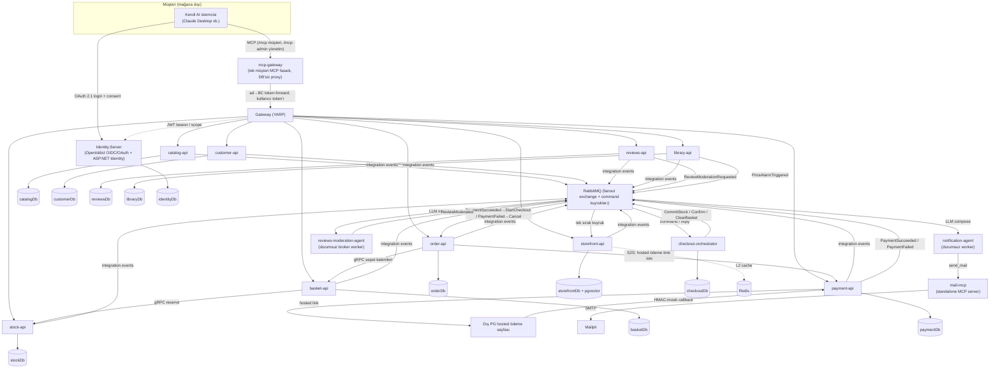

# Agent Framework ile E-Ticaret

> Olay-güdümlü, Domain-Driven mikroservis e-ticaret platformu — müşteri yüzeyi tamamen **kendi getirdiğin AI istemcisi** (Claude Desktop vb.) üzerinden, uçtan uca **.NET Aspire** ile orkestre.

<p>
  
  
  
  
  
  
  
  
  
  
  
</p>

## Genel Bakış

Her servisin kendi veritabanına sahip, izole bir **bounded context** olduğu tam bir **mikroservis e-ticaret backend'i**. Context'ler arası iletişim yalnızca **integration event**, **Model Context Protocol (MCP)** ve — bir adımın anlık evet/hayır ya da context'ler arası devir gerektirdiği yerde — sanksiyonlu **tipli gRPC** (stok rezervi), **broker command/reply** (checkout sağası) ve **servisten-servise (S2S) çağrı** (Order → Payment hosted ödeme linki) üzerindendir.

Bu proje **agent-only / BYO-agent** duruşundadır: mağaza **ne görsel ekran ne de kendi sohbet agent'ını** host eder. Müşteri **kendi AI istemcisiyle** (Claude Desktop vb.) tek MCP fasadına bağlanır; işlemler alt bounded context'lerin MCP tool'larına, çağıran kullanıcının token'ıyla proxy'lenir. İki AI agent worker'ı çekirdeğin çevresinde durur, ikisi de **Microsoft Agent Framework** üzerinde:

- **Reviews Moderation Agent** — ürün yorumlarını LLM ile moderasyon eden **durumsuz broker worker'ı** (structured JSON, sıcaklık 0, MCP yok). `ReviewModerationRequested` event'ini tüketir, metni sınıflar, `ReviewModerated` ile yanıtlar — Reviews context'i sıfır agent-framework kodu taşır, moderasyon modeli bir olay sınırının ardında kalır.
- **Notification Agent** — fiyat alarmı e-postası yazan **durumsuz worker** (DB yok). `PriceAlarmTriggered`'ı tüketir, tek LLM çağrısıyla maili yazar ve **Mail.Mcp**'nin `send_mail` tool'unu çağırır, `NotificationSent` yayınlar.

Katalog **first-party**'dir: mağaza envanterin sahibidir, ürün girişi düz ürün-CRUD'dur (eski çok-tedarikçili besleme hattı bilinçli olarak söküldü). Yeni ürünler `Catalog → Stock` (ilk stok) ve `Catalog → Storefront` (read-model) yönünde integration event akar.

DDD, CQRS ve olay-güdümlü tasarımın gerçek .NET kodunda ne kadar ileri taşınabileceğini — ve modern bir LLM agent'ının bu mimariye iş mantığını agent katmanına sızdırmadan nasıl temiz eklendiğini — göstermek için kurulmuş bir portföy / öğrenme projesidir.

## Bu proje neyi gösteriyor

- **Bounded-context izolasyonu** — kendi PostgreSQL veritabanı + Marten şeması olan on bir DB-sahibi bounded context, artı YARP gateway, tek müşteri MCP fasadı ve iki agent worker'ı. Paylaşılan domain modeli yok; aynı kavram (*Ürün*) her context'te farklı modellenir — Catalog'da zengin aggregate, Basket'te düz sepet-kalemi, Storefront'ta read-model satırı.
- **Zengin aggregate'ler ve zorunlu invariant'lar** — iş kuralları handler'da değil aggregate'in içinde yaşar (private koleksiyon, davranış metotları). Geçersiz durumlar temsil edilemez.
- **Vertical Slice + CQRS** — kod teknik katmana değil feature'a göre örgütlenir. Yazma/okuma ayrı slice'lar; repository yok — handler doğrudan Marten `IDocumentSession` kullanır.
- **Exception yerine Result pattern** — beklenen hatalar (bulunamadı, doğrulama, kural ihlali) tipli `Result` nesneleriyle akar; exception yalnız gerçekten beklenmeyene ayrılır.
- **Scope-tabanlı yetkilendirme** — kimlik OpenIddict + ASP.NET Identity ile verilir; servisler OAuth **scope**'larına göre yetkilendirir (rol downstream'e sızmaz), hem HTTP uçlarında hem Wolverine mesaj handler'larında.
- **Agent-only müşteri yüzeyi (tek MCP fasadı, 073)** — tüm müşteri ekranları ve mağazanın kendi ChatAgent'ı **bilinçli söküldü**. Müşteri kendi AI istemcisiyle **mcp-gateway** fasadına bağlanır: tek `/mcp` (müşteri) + tek `/mcp-admin` (yönetim), tek login. Tool'lar alt BC `/mcp`'lerinden LAZY toplanır, çağrı sahibine kullanıcı token'ıyla proxy'lenir.
- **Dış agent MCP OAuth (061)** — kullanıcının kendi AI agent'ı MCP uçlarına **OAuth 2.1** ile bağlanır: RFC 7591 **DCR** (istemci kendini kaydeder), RFC 9728 **PRM** keşfi, tek **consent** sayfası (Explicit), refresh token ile ekransız süreklilik, revocation. `basket/order/customer/payment` MCP korumalı; `storefront/catalog/stock` anonim gezinme için açık kalır.
- **MCP'de admin yüzeyi (070)** — `catalog/stock/customer` ikinci korumalı `/mcp-admin` ucu açar (anonim keşif seti değişmez; tool seti oturum açılışında açık allowlist ile budanır). Her admin yazma BC'sinde salt-append `AdminActionLog` izi.
- **Push-only read model + asistan sorgu yüzeyi** — `storefront` servisi katalog + stok + yorum özetini birleştiren ürün-merkezli görünümü **tek sıralı kuyruk**ta tüketilen integration event'lerle kurar (dışa çağrı/backfill yok). Müşteri okuma yüzeyi tek tool: `query_storefront` (069) — salt-okur `storefront_sellable` view + `AgentSqlGuard` bekçisi + kısıtlı DB rolü + `{{EMBED}}` semantik yerleştirme + `AgentQueryLog` izi.
- **Semantik arama (pgvector)** — `text-embedding-3-small` embedding'leri yalnız arama metninin hash'i değiştiğinde `ProductChangedEvent`'te üretilir, `storefrontDb`'de yan doküman olarak saklanır, ham kosinüs-mesafe SQL join ile sorgulanır. Embedding kesintisi view yazımını ya da filtre-only aramayı bloklamaz.
- **Satın-alma şartlı yorum + sınır-ardı moderasyon** — `reviews` context'i yalnız ürünü gerçekten satın alan kullanıcıdan 1–5★ yorum kabul eder; hak, `OrderCompleted` event'inden yerel projeksiyonla belirlenir (senkron çağrı değil). AI moderasyon ayrı broker worker'da çalışır; puan özeti Storefront'a akar.
- **Hosted-CF ödeme (077)** — kart alanı sistemden geçmez. Payment BC bir **hosted ödeme linki** üretir (PG hosted sayfası), müşteri orada öder, PG **HMAC-imzalı callback** ile döner → `PaymentSucceeded`/`PaymentFailed` fanout. Terk-timer (`ScheduleAsync`) callback gelmezse Expire eder; `TxRef` unique olduğu için idempotent.
- **Dayanıklı checkout orkestrasyonu (broker-only saga)** — checkout, kendi `Checkout.Orchestrator` servisinde Wolverine dayanıklı sağası olarak çalışır (durum Marten'de, `CheckoutId` anahtarlı). 077'de ödeme öncedendir → saga yalnız `CommitStock → Confirm → ClearBasket` sürer (Charge adımı söküldü). `CommittingStock`'ta stok başarısızsa LIFO telafi + takılan koşu için watchdog.
- **Fiyat alarmı + bildirim** — `library` context'i kullanıcı-ürün ilgi kayıtlarını ve yaşayan fiyat alarmı aboneliklerini tutar; `ProductChangedEvent.OldPrice` tetiğiyle alarm başına `PriceAlarmTriggered` yayınlar; Notification Agent maili üretir.
- **Bildirimsel, kesişen caching** — okuma sorguları tek `[Cached(...)]` attribute'uyla, HybridCache üzerine `IMessageBus` decorator'ıyla önbelleklenir (L1 bellek-içi + opsiyonel Redis L2). Handler'lar dokunulmadan kalır.
- **Tek komutla orkestrasyon** — .NET Aspire her servisi, gateway'i, Postgres, RabbitMQ ve Redis'i service discovery + connection-string enjeksiyonuyla ayağa kaldırır.
- **Spec-driven development** — önemsiz olmayan feature'lar GitHub spec-kit akışıyla (spec → plan → tasks → implement), proje anayasasının yönetiminde geliştirilir.

## Mimari



Her servis kendi kendine yeten bir bounded context'tir. Senkron okuma/yazma trafiği **YARP gateway → servis** üzerinden gider; Identity.Server'ın verdiği OAuth scope'lu JWT bearer token'larla korunur. Durum değişiklikleri RabbitMQ fanout exchange'lerinde **integration event** olarak yayınlanır; `storefront` read modeli tamamen bu event'leri **tek sıralı kuyruk**ta tüketerek kurulur (aynı birleşik satıra eşzamanlı yazımı yapısal olarak eler).

Müşteri hiçbir mağaza ekranı açmaz: **kendi AI istemcisiyle** `mcp-gateway` fasadına bağlanır. Fasad, alt BC `/mcp` uçlarındaki tool'ları LAZY toplar (SDK `WithListToolsHandler`/`WithCallToolHandler`), tool adına göre sahip BC'ye çağrıyı **kullanıcı token'ıyla** proxy'ler (`PerUserMcpTool` server ikizi) — agent *o kullanıcı olarak* davranır.

Olaylar dışında iki senkron kanal sanksiyonludur. **Stok rezervi** tipli **gRPC** kontratı (`Shared/Protos`) üzerindedir: Basket sepete-eklemede Stock'u senkron çağırır (fail-closed). **Order → Payment hosted ödeme linki** ise **servisten-servise** çağrıdır (kart alanı LLM'e/mesaja sızmaz). **Checkout** kendi `Checkout.Orchestrator` servisinde **broker command/reply** sağası olarak çalışır.

## Ödeme + sipariş akışı (077, hosted-CF)

Müşteri hiçbir ekrana dokunmadan, sohbetten uçtan uca ödeyip sipariş verir — ama kart verisi asla LLM'e teslim edilmez:

1. **Ödeme başlat** — müşteri (AI istemcisi → mcp-gateway) `start_payment`'ı tetikler (Order.Api agent slice'ı). Order sepeti (Basket gRPC, sunucu-yetkili) + adresi okur, **Pending** bir sipariş yaratır ve Payment'tan **S2S** ile hosted ödeme linki ister.
2. **Hosted ödeme** — Payment bir `PaymentIntent` yaratır (kart alanı yok), PG hosted linkini (`PgHostedPaymentClient`, `MerchantKey` S2S) üretir; müşteri PG'nin hosted sayfasında öder.
3. **Callback** — PG, ayrı `CallbackSecret` ile **HMAC-imzalı** callback döner; Payment doğrular → `PaymentSucceeded` veya `PaymentFailed` yayınlar. `TxRef` unique olduğu için idempotent; callback gelmezse terk-timer (`ScheduleAsync`) Expire eder.
4. **Saga tetiği** — Order `PaymentSucceeded`'ı tüketir → `StartCheckout` yayınlar (`CheckoutId = OrderId`) / `PaymentFailed` → siparişi Cancel eder.
5. **Checkout sağası** — `Checkout.Orchestrator` `CommitStock (kalem başına) → Confirm → ClearBasket` sürer (ödeme önceden olduğu için Charge adımı yok). Stok başarısızsa LIFO telafi + watchdog.
6. **Tamamlanma** — Order `Confirm`'de `OrderCompleted` fanout eder (Reviews yorum-hakkı + Storefront `UserPurchase`).

Neden ödeme hosted + S2S: `paymentId` başarı kanıtı değildir; halüsine bir "başarılı" bedava sipariş demektir. O yüzden ödeme dış PG'nin hosted sayfasında olur, doğrulama HMAC callback ile **sunucu tarafında**dır; LLM yalnız akışı başlatır. Kart ekleme/çıkarma sohbette **reddedilir** (güvenlik) — kart mağazanın işi değil (PSP sorumluluğu).

## Teknoloji Yığını

| Alan | Teknoloji |
|------|-----------|
| Çalışma zamanı | .NET 10, C# (nullable + implicit usings) |
| Orkestrasyon | .NET Aspire (AppHost + ServiceDefaults) |
| Kalıcılık | Marten (PostgreSQL document / event store) |
| Bus & messaging | Wolverine (CQRS bus + RabbitMQ messaging + dayanıklı saga) |
| Messaging transport | RabbitMQ (fanout exchange + command/reply kuyrukları) |
| Caching | HybridCache (L1 bellek + opsiyonel Redis L2), AOP decorator |
| Kimlik & yetki | OpenIddict + ASP.NET Identity (OIDC/OAuth, scope-tabanlı) + RFC 7591 DCR |
| API Gateway | YARP (Aspire service discovery ile) |
| Müşteri yüzeyi | Tek MCP fasadı (`mcp-gateway`) — dış AI istemcisi tüketir |
| Senkron RPC | gRPC (stok rezervi, sepet kalemleri — paylaşılan proto kontratları) |
| AI agent'lar | Microsoft Agent Framework + Microsoft.Extensions.AI (OpenAI), MCP |
| Semantik arama | pgvector (`text-embedding-3-small`) |
| DI | Scrutor (konvansiyon-tabanlı otomatik kayıt) |
| Test | xUnit + Shouldly (saf domain birim testleri) |

## Servisler

| Proje | Sorumluluk |
|---------|----------------|
| `catalog-api` | Zengin `Product` + `Category` + `Author` + `Publisher` + tag + spesifikasyon (kitap künyesi: çok-yazar, tek yayınevi); first-party ürün yazımı + admin düzenleme + fiyat geçmişi; korumalı `/mcp-admin` |
| `basket-api` | Kalıcı sepet + kalem; anonim sahiplik; stok tutmaz; yüzey MCP-only + checkout gRPC |
| `order-api` | Sipariş aggregate + yaşam döngüsü; `start_payment` (sepet+adres oku, Pending sipariş, Payment S2S hosted link); `PaymentSucceeded→StartCheckout` / `PaymentFailed→Cancel`; Confirm'de `OrderCompleted` fanout |
| `stock-api` | `ProductStock` (OnHand); ilk stok `ProductLinked`'ten; checkout düşümü broker'dan; gRPC rezerv sunucusu; korumalı `/mcp-admin` |
| `payment-api` | Hosted-CF ödeme (077): `PaymentIntent` (kart alanı yok); PG hosted link + HMAC callback → `PaymentSucceeded`/`PaymentFailed`; terk-timer; `TxRef` unique idempotent |
| `storefront-api` | Push-only birleşik read model (katalog + stok + yorum özeti); tek asistan tool `query_storefront` (`AgentSqlGuard` + kısıtlı DB rolü + pgvector semantik + `AgentQueryLog`) |
| `customer-api` | Wallet (tokenize kart, PAN yok; kart YAZMA yüzeyi yok — salt okuma + payment-context) + AddressBook + `MerchantInformation`; korumalı `/mcp-admin` (merchant kimlik + PG onboarding) |
| `reviews-api` | Satın-alma şartlı yorum (1–5★); hak `OrderCompleted` event'inden; AI moderasyon ayrı worker'a; puan özeti Storefront'a |
| `library-api` | Kullanıcı-ürün ilgi kayıtları + yaşayan fiyat alarmı aboneliği (email snapshot) + `NotificationRecord`; `ProductChangedEvent.OldPrice` tetiği → `PriceAlarmTriggered` |
| `checkout-orchestrator` | Standalone broker-only checkout sağası (`checkoutDb`): `CommitStock → Confirm → ClearBasket`; LIFO telafi + watchdog (ödeme öncedendir) |
| `gateway` | YARP reverse proxy / tek giriş (MCP + PRM rotaları) |
| `identity-server` | OpenIddict + ASP.NET Identity — OIDC/OAuth authority + RBAC (rol = scope demeti) + RFC 7591 DCR + consent + revocation |
| `mcp-gateway` | Tek müşteri MCP fasadı (DB'siz proxy); alt BC `/mcp`'lerini LAZY toplar, ad→BC token-forward proxy; tek `/mcp` (müşteri) + `/mcp-admin` (yönetim), tek login |
| `reviews-moderation-agent` | Durumsuz broker worker — `ReviewModerationRequested → LLM (structured JSON) → ReviewModerated`; DB yok, MCP yok |
| `notification-agent` | Durumsuz worker — `PriceAlarmTriggered → LLM compose → Mail.Mcp send_mail → NotificationSent`; DB yok |
| `mail-mcp` | İlk standalone MCP server; tek tool `send_mail` (MailKit → Mailpit); yalnız Notification Agent tüketir |

Paylaşılan temeller `src/others` altında: `Common` (domain yapı taşları, result, caching), `Shared` (integration-event kontratları + gRPC protolar) ve `Identity.Server`.

## Öne Çıkan Tasarım Kararları

- **Bir mikroservis = bir bounded context.** Sınır fiziksel ve sert: ayrı veritabanı, ayrı şema, ayrı domain modeli. Servisler DB paylaşmaz, bir context'in modelini diğerine sızdırmaz.
- **Aggregate'ler invariant'larının sahibidir.** Yeni kural handler'a değil aggregate metoduna gider. Koleksiyonlar private, salt-okunur açılır; mutasyon yalnız davranış metotlarından akar.
- **Exception yerine Result.** Tüm handler, aggregate metodu ve endpoint bir `Result` döner; endpoint `IsSuccess`'i `Ok`/`BadRequest`'e çevirir.
- **Agent-only müşteri yüzeyi, tek fasad.** Her müşteri işlemi MCP paritesine ulaşınca ekranlar ve mağazanın kendi agent'ı söküldü; mağaza artık BYO-agent. Müşteri kendi AI istemcisiyle tek `mcp-gateway` fasadına bağlanır, tek login yeterlidir.
- **MCP yalnız agent tüketir.** Agent olmayan kod imperatif `CallToolAsync` süremez → REST/gRPC/S2S. MCP tool'ları ince sarmalayıcıdır: aynı Wolverine command/query'yi çağırır, yalnız LLM-dostu ad + açıklama ekler; sıfır iş-mantığı tekrarı.
- **Saga bir servistir, bir god-object değil.** Checkout orkestrasyonu dört context'e yayılan bir süreç sahibidir, o yüzden **kendi BC'sinde** yaşar ve yalnız broker command/reply konuşur — asla başka servisin veritabanı.
- **İki-fazlı ödeme yerine hosted-CF.** Ödeme dış PG'nin hosted sayfasında, checkout'tan **önce** olur; başarı HMAC callback ile doğrulanır. Saga içinde authorize/capture/void makinesi yoktur — ödeme saga dışıdır, saga yalnız stok+onay sürer.
- **Servisler arası anlık evet/hayır gereken yerde senkron RPC.** Stok rezervi (basket/order → stock) sanksiyonlu senkron kanaldır: tipli gRPC, scope-korumalı, fail-closed. DB izolasyonu korunur — çağıran Stock'un API'sine erişir, veritabanına değil.
- **Servisler arası transaction yerine idempotency.** Context'ler arası yazımlar transaction paylaşamaz; saga bunun yerine yakınsar: deterministik anahtarlar (`CheckoutId`/`TxRef`), en-az-bir-kez teslim, iş hataları sonsuz retry yerine telafiye yönlendirilir.
- **Eventual-consistency akışları event kullanır, gRPC değil.** Satın-alma sonrası yazılan yorum anlık yanıt gerektirmez, o yüzden hak `OrderCompleted` projeksiyonudur — gRPC yalnız anlık-tutarlılığa (stok) ayrılmıştır.
- **Moderasyon modeli bir olay sınırının ardında.** Reviews sıfır agent-framework kodu taşır; moderasyon ayrı broker worker'dır, LLM bağımlılığı yorum-yazma context'ine sızmaz.
- **Rol downstream'e sızmaz — yalnız scope.** Identity rol verir (rol = scope demeti); servisler saf scope'a göre yetkilendirir. Okumalar (stok, storefront) anonim; token alışveriş yazma yolunda önemlidir.

## Başlangıç

### Ön koşullar

- [.NET 10 SDK](https://dotnet.microsoft.com/)
- Docker (Aspire; PostgreSQL, RabbitMQ, Redis ve Mailpit'i container olarak sağlar)

### Tüm sistemi çalıştır

Dağıtık sistemi her zaman **Aspire AppHost** üzerinden başlat — servisler birbirini, veritabanlarını ve RabbitMQ'yu Aspire service discovery ile bulur. Tek bir API'yi bağımsız çalıştırmak bağımlılıklarını çözemez.

```bash
# Repo kökünden
dotnet run --project src/aspire/AppHost/AppHost.csproj
```

Bu; her servisi, YARP gateway'i, Identity.Server'ı, mcp-gateway fasadını ve agent worker'larını, artı PostgreSQL, RabbitMQ (management eklentisiyle), Redis ve Mailpit'i ayağa kaldırır. **Aspire dashboard** her kaynağın canlı görünümü, logları ve uçlarıyla açılır.

> Identity.Server **HTTPS** üzerinde çalışmalıdır (`SameSite=None; Secure` çerezleri düz HTTP'de sonsuz döner).

OpenAI kullanan servisler (**Reviews Moderation Agent**, **Notification Agent**, ve embedding için **Storefront**) kimlik bilgisi olmadan açılışta fail-fast eder:

```bash
dotnet user-secrets set "OpenAI:ApiKey" "<key>" --project src/agents/Reviews.Moderation/Reviews.Moderation.csproj
dotnet user-secrets set "OpenAI:Model"  "gpt-4o-mini" --project src/agents/Reviews.Moderation/Reviews.Moderation.csproj
dotnet user-secrets set "OpenAI:ApiKey" "<key>" --project src/agents/NotificationAgent/NotificationAgent.csproj
dotnet user-secrets set "OpenAI:ApiKey" "<key>" --project src/services/storefront/Storefront.Api/Storefront.Api.csproj
```

### Kendi AI istemcini bağla

Müşteri yüzeyi bir MCP fasadıdır. Kendi MCP istemcin (Claude Desktop vb.) fasadın `/mcp` ucuna bağlanır; ilk bağlantıda tarayıcıda bir kez OAuth login + consent yapılır (RFC 7591 DCR ile istemci kendini kaydeder), sonrası refresh token'la ekransız sürer.

### Derle & test et

```bash
# Tüm çözümü derle
dotnet build

# Tüm testleri çalıştır
dotnet test

# Tek bir test projesi
dotnet test tests/Catalog.Api.Tests/Catalog.Api.Tests.csproj
```

## Proje Yapısı

```
src/
  aspire/        AppHost (orkestrasyon) + ServiceDefaults
  services/      basket, catalog, checkout, customer, gateway, library,
                 order, payment, reviews, stock, storefront
  others/        Common, Shared (kontratlar + protolar), Identity.Server
  agents/        Mcp.Gateway (müşteri MCP fasadı), Mail.Mcp (send_mail),
                 NotificationAgent (fiyat alarmı), Reviews.Moderation (moderasyon)
tests/           Servis başına domain birim testleri (xUnit + Shouldly)
.specify/        Spec-driven development kurulumu (spec-kit)
specs/           Feature spec / plan / task'ları
```

Tek bir servis **Vertical Slice** düzeni izler — kod teknik katmana değil domain feature'ına göre gruplanır:

```
Domains/<Aggregate>/
  <Aggregate>.cs                  # zengin aggregate root (fabrika + davranış metotları)
  <Aggregate>EndpointExtension.cs # Minimal API endpoint map'i
  <Aggregate>McpTools.cs          # bu aggregate için MCP tool sarmalayıcıları
  Features/
    Commands/                     # yazma slice'ları  (IDocumentSession, [Transactional])
    Queries/                      # okuma slice'ları   (salt-okur)
    Agents/                       # agent'a açık slice'lar (MCP expose eder)
```

Her bounded context ayrıca bir `FLOW.md` taşır — o context'in iş adımlarını, invariant'larını ve sınırını EventStorming irtifasında anlatan domain-süreç belgesi, `scripts/check-flow-links.sh` ile guard'lı.

## Notlar

- **Central Package Management** açık — paket sürümleri tek tek `.csproj`'larda değil `Directory.Packages.props`'ta yaşar.
- Önemsiz olmayan feature'lar **spec-kit** akışıyla (`/speckit-*`), `.specify/memory/` altındaki proje anayasasının yönetiminde geliştirilir. Artefakt derinliği feature boyutuna göre ölçeklenir.

---

*Domain-Driven mikroservisler ve .NET yığınında AI agent'larının pratik bir keşfi olarak inşa edildi.*