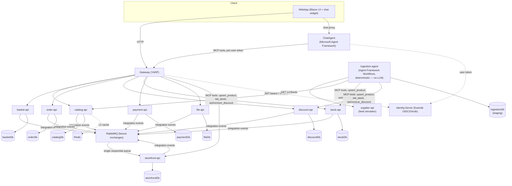

# ECommerce with Agent Framework

> An event-driven, Domain-Driven microservices e-commerce platform with a built-in AI shopping agent — orchestrated end-to-end with .NET Aspire.

<p>
  
  
  
  
  
  
  
  
  
  
</p>

## Overview

This is a full **microservices e-commerce backend** where every service is an isolated **bounded context** with its own database, and cross-context communication happens only through **integration events** and the **Model Context Protocol (MCP)**. On top of it sit two agent applications: **ChatAgent**, an AI assistant built on the **Microsoft Agent Framework** that acts as an MCP client — it can browse the catalog, manage a basket, and place orders on behalf of a user by calling each service's MCP tools with that user's token — and **IngestionAgent**, a fully deterministic supplier-ingestion pipeline built on **Agent Framework Workflows** that syncs a supplier feed into the domain by calling the same MCP tools directly, with no LLM in the write path.

It's a portfolio / learning project built to demonstrate how far you can push **DDD, CQRS, and event-driven design** in real .NET code — and how a modern LLM agent plugs into that architecture cleanly, without leaking business logic into the agent layer.

## What this project demonstrates

- **Bounded-context isolation** — 9 services, each with its own PostgreSQL database and Marten schema. No shared domain model; the same concept (e.g. *Discount*) is modeled differently in each context.
- **Rich aggregates & enforced invariants** — business rules live inside aggregates (private collections, behavior methods), not in handlers. Illegal states are unrepresentable.
- **Vertical Slice + CQRS** — code is organized by feature, not by technical layer. Writes and reads are separate slices; no repositories — handlers use Marten's `IDocumentSession` directly.
- **Result pattern over exceptions** — expected failures (not-found, validation, rule violations) flow through typed `Result` objects; exceptions are reserved for the truly unexpected.
- **Scope-based authorization** — identity issued by Duende IdentityServer; services authorize on OAuth **scopes** (no roles), enforced on HTTP endpoints *and* on Wolverine message handlers.
- **Push-only read model** — the `storefront` service maintains a product-centric composite view (catalog + stock + discount) fed purely by integration events — no outbound calls, no backfill.
- **Declarative, cross-cutting caching** — read queries are cached with a single `[Cached(...)]` attribute via an `IMessageBus` decorator over HybridCache (L1 in-memory + optional Redis L2). Handlers stay untouched.
- **AI agent as a first-class client** — each service exposes its Wolverine commands/queries as MCP tools; ChatAgent consumes them per-user. MCP tools are thin wrappers — zero business logic duplication.
- **MCP as a contract, LLM only where judgment is needed** — the supplier-ingestion pipeline (`ingestion-agent`) runs a per-record **Agent Framework Workflow** (staging gate → domain write) and calls `upsert_product` / `set_stock` / `set_product_discount` MCP tools *directly*. Decisions are deterministic (content gate via record value equality, SKU-keyed upsert, failed-record retry), so there is deliberately **no LLM in the write path** — idempotent by design: unchanged feeds are skipped, lost results self-heal on the next run.
- **One-command orchestration** — .NET Aspire spins up every service, gateway, Postgres, RabbitMQ, and Redis with service discovery and connection-string injection.
- **Spec-driven development** — non-trivial features go through a GitHub spec-kit flow (spec → plan → tasks → implement) governed by a project constitution.

## Architecture



Each service is a self-contained bounded context. Synchronous read/write traffic goes **client → YARP gateway → service**, secured by JWT bearer tokens with OAuth scopes issued by Identity.Server. State changes are published as **integration events** over RabbitMQ fanout exchanges; the `storefront` read model is built entirely by consuming those events on a **single sequential queue** (structurally eliminating concurrent writes to the same composite row). The **ChatAgent** reaches the services' MCP endpoints through the gateway, injecting the calling user's token at invocation time so the agent acts *as that user*. The **IngestionAgent** periodically pulls the supplier feed (30-minute scheduler or `POST /v1/ingestion/runs`), stages each record with an idempotency gate, and writes changes to Catalog/Stock/Discount through their MCP tools — one record at a time, fully deterministic.

## Tech Stack

| Area | Technology |
|------|-----------|
| Runtime | .NET 10, C# (nullable + implicit usings) |
| Orchestration | .NET Aspire (AppHost + ServiceDefaults) |
| Persistence | Marten (PostgreSQL as document / event store) |
| In-process bus & messaging | Wolverine (CQRS bus + RabbitMQ integration messaging) |
| Messaging transport | RabbitMQ (fanout exchanges) |
| Caching | HybridCache (L1 in-memory + optional Redis L2), AOP decorator |
| Identity & AuthZ | Duende IdentityServer (OIDC/OAuth, scope-based) |
| API Gateway | YARP (with Aspire service discovery) |
| AI Agent | Microsoft Agent Framework + Microsoft.Extensions.AI (OpenAI), MCP |
| UI | Blazor WebApp |
| DI | Scrutor (convention-based auto-registration) |
| Testing | xUnit + Shouldly (pure domain unit tests) |

## Services

| Project | Responsibility |
|---------|----------------|
| `catalog-api` | Products and their details (Catalog bounded context) |
| `basket-api` | User baskets, items, applied discounts |
| `order-api` | Order placement and lifecycle |
| `discount-api` | Discount codes and rates as a full aggregate |
| `stock-api` | Product stock levels |
| `payment-api` | Payment processing |
| `file-api` | Product image storage/serving (internal) |
| `storefront-api` | Push-only composite read model (catalog + stock + discount) |
| `supplier-api` | Supplier feed simulator — one typed JSON endpoint, no DB, no bus |
| `gateway` | YARP reverse proxy / single entry point |
| `identity-server` | Duende IdentityServer — OIDC/OAuth authority |
| `chat-agent` | AI shopping assistant (MCP client over the gateway) |
| `ingestion-agent` | Deterministic supplier-ingestion pipeline (Agent Framework Workflows + direct MCP tool calls, staging in `ingestionDb`) |
| `ecommerce-web` | Blazor storefront UI with an embedded chat widget |

Shared foundations live under `src/others`: `Common` (domain building blocks, results, caching), `Shared` (integration-event contracts), and `Identity.Server`.

## Key Design Decisions

- **A microservice = a bounded context.** The boundary is physical and hard: separate database, separate schema, separate domain model. Services never share a database or leak one context's model into another.
- **Aggregates own their invariants.** New rules go on the aggregate method, never in a handler. Collections are private and exposed read-only; mutation only flows through behavior methods.
- **Result over exceptions.** All handlers, aggregate methods, and endpoints return a `Result`; endpoints translate `IsSuccess` into `Ok`/`BadRequest`.
- **Caching is a decorator, not middleware.** Wolverine's `Before/After` hooks can't return a value on short-circuit, so caching is implemented as a transparent `IMessageBus` decorator (Scrutor `Decorate`) — endpoints and handlers stay unaware.
- **The agent adds no business logic.** MCP tools re-invoke the same Wolverine command/query via `IMessageBus`; they only add an LLM-friendly name and description.
- **No LLM where decisions are deterministic.** The ingestion write path originally used LLM writer agents; they were deliberately removed — when the decision is already made in code, an LLM only adds cost, latency, and silent-failure modes. MCP stays as the cross-service contract; the tools are just called directly.
- **Idempotency over transactions across services.** Cross-context writes can't share a transaction (deliberate dual-write). The ingestion pipeline converges instead: SKU-keyed upsert, absolute `set_stock`, a content gate that only seals on success, and full re-sync on retry.
- **No roles — scopes only.** Role-based authorization was intentionally removed; authorization is purely scope-based. Reads (stock, discount, storefront) are anonymous; tokens matter on the shopping write path.

## Getting Started

### Prerequisites

- [.NET 10 SDK](https://dotnet.microsoft.com/)
- Docker (Aspire provisions PostgreSQL, RabbitMQ, and Redis as containers)

### Run the whole system

Always start the distributed system through the **Aspire AppHost** — services discover each other, their databases, and RabbitMQ via Aspire service discovery. Running a single API standalone will fail to resolve its dependencies.

```bash
# From the repo root
dotnet run --project src/aspire/AppHost/AppHost.csproj
```

This brings up every service, the YARP gateway, Identity.Server, the Blazor UI, the ChatAgent, plus PostgreSQL (with pgAdmin), RabbitMQ (with the management plugin), and Redis. The **Aspire dashboard** opens with a live view of every resource, its logs, and its endpoints.

> Identity.Server must run over **HTTPS** (its `SameSite=None; Secure` cookies loop forever on plain HTTP).

### Build & test

```bash
# Build the whole solution
dotnet build

# Run all tests
dotnet test

# Run a single test project
dotnet test tests/Catalog.Api.Tests/Catalog.Api.Tests.csproj
```

## Project Structure

```
src/
  aspire/        AppHost (orchestration) + ServiceDefaults
  services/      basket, catalog, discount, file, gateway,
                 order, payment, stock, storefront, supplier
  others/        Common, Shared, Identity.Server
  agents/        ChatAgent (MCP client, LLM) + IngestionAgent (Workflows, no LLM)
  ui/            WebApp (Blazor)
tests/           Per-service domain unit tests (xUnit + Shouldly)
.specify/        Spec-driven development setup (spec-kit)
specs/           Feature specs / plans / tasks
```

A single service follows a **Vertical Slice** layout — code grouped by domain feature, not technical layer:

```
Domains/<Aggregate>/
  <Aggregate>.cs                  # rich aggregate root (factory + behavior methods)
  <Aggregate>EndpointExtension.cs # Minimal API endpoint mapping
  <Aggregate>McpTools.cs          # MCP tool wrappers for this aggregate
  Features/
    Commands/                     # write slices  (IDocumentSession, [Transactional])
    Queries/                      # read slices   (read-only)
    Agent/                        # agent-facing slices (exposed via MCP)
```

## Notes

- **Central Package Management** is enabled — package versions live in `Directory.Packages.props`, not individual `.csproj` files.
- Non-trivial features are built with a **spec-kit** flow (`/speckit-*`), governed by a project constitution under `.specify/memory/`. Artifact depth scales with feature size.

---

*Built as a hands-on exploration of Domain-Driven microservices and AI agents on the .NET stack.*